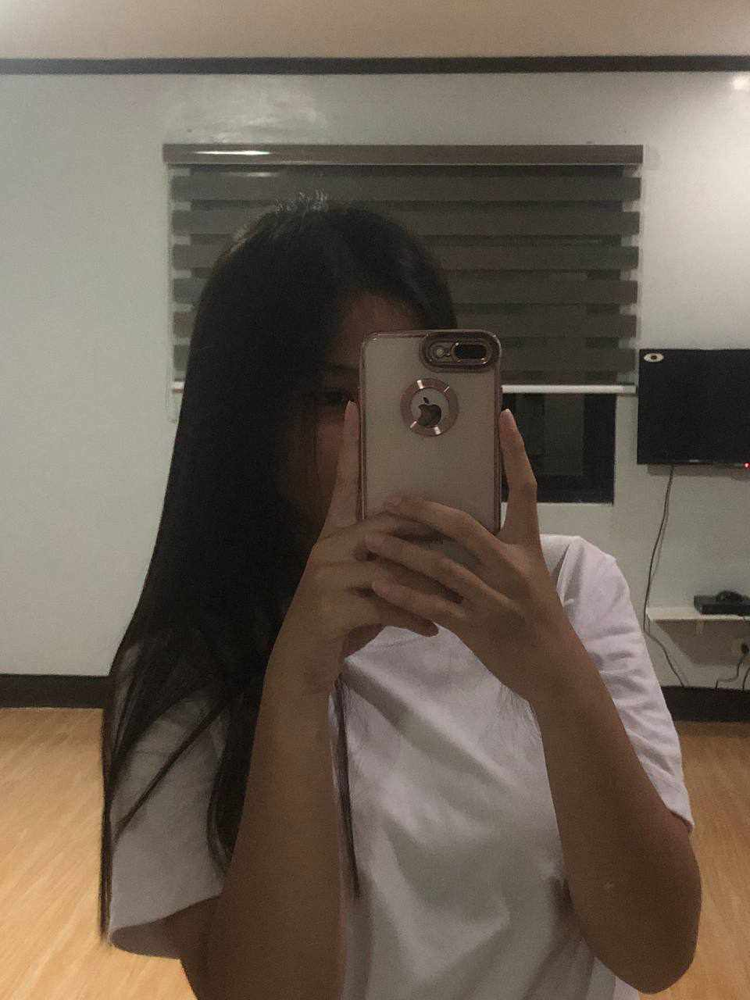
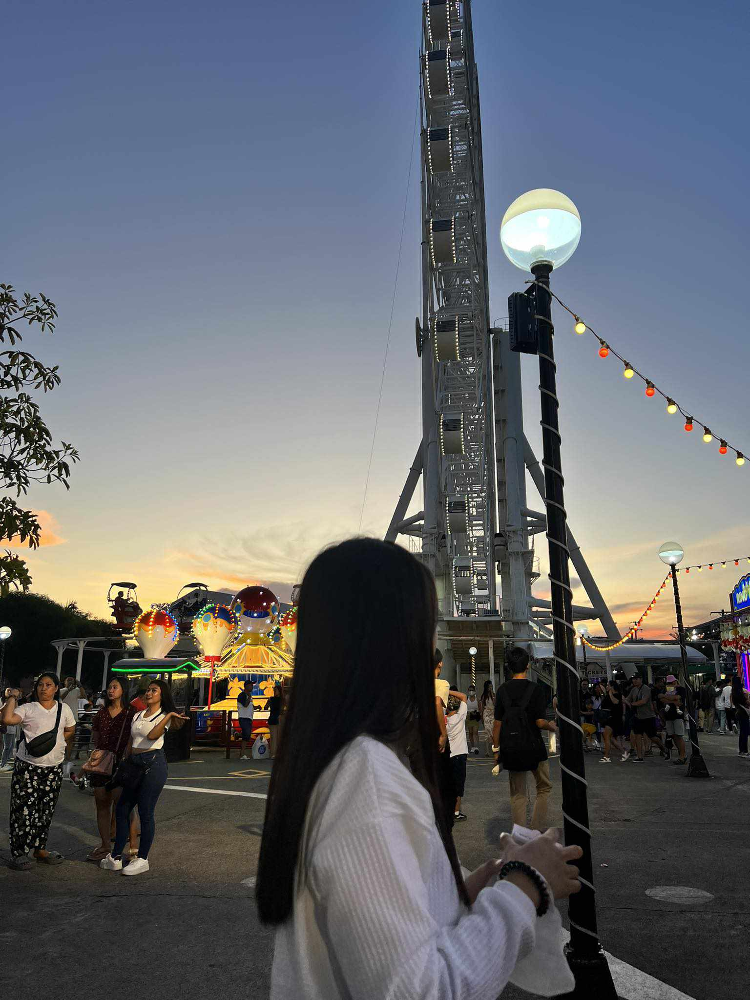

<!DOCTYPE html>
<html lang="en">
<head>
    <link rel="stylesheet" type="text/css" href="css/style.css">
    <title>ms. kae</title>
</head>
    
<body>

    <header>
       

             <ul>
                 <li><a href="index.html">Home</a></li>
                 <li><a href="more.html">more</a></li>
             </ul>
                 
                
        

        

            <a href="randompic.html"target="_blank" class="btn"><b>randompic</b></a>
            <a href="contact.html"target="_blank" class="btn"><b>contact</b></a>
        

        

            <h1>mejo apology letter</h1>
        

        

    </header>
</body>
</html>
</body>
</html>

<!DOCTYPE html>
<link rel="stylesheet" 
href="css/style2.css">
<head>
    <title>Ms.k</title>

</head>
<body>
    <a href="index.html">Home</a>
    <h1>hiiii my miss k (doble meaning)</h1>
    <h2>dapat face mo nakalagay dito e grrr para sa'yo 'to e</h2>

    

        
        
hi bff mweheheh let's talk na ulit hanggang gabi 

        
        
joke joke lang naman to diba??? so yeah let's stay sa bff code name (CODE NAME HAHAHAHAHAHA)

        
        
di ko sinunod instructions mo na 300 words and dapat may vid na umiiyak AHAHHAHAAHA

        
        
300+ lines itong code para alam mo

</body>
</html>

<!DOCTYPE html>
<link rel="stylesheet"
href="css/style4.css">
<head>
    <title>pic na ano wala</title>

</head>
<body>
    <a href="index.html">Home</a>
     
    <h1>last mo muna 'to </h1>  

    

        <i>update ko na lang ito pag may bagong pic. hindi q naman to gallery so...  dejoke d2 q lalagay pic natin soon (oo na agad assuming aq e)
        </i>
    

    <video width="320" height="240" controls>
        <source src="vid2.mp4" type="video/mp4">
      </video>
</body>
</html>

<!DOCTYPE html>
<html lang="en">
<link rel="stylesheet"
href="css/style5.css">

<head>
<body>
    <a href="index.html">Home</a>
     

        

            <h1>Contact information</h1>
            <h2>required talaga to sa website (lam q na alam mo na lahat ng info na ito)</h2>
        

        

            <ul>
                <li><a href="https://www.facebook.com/Mariz.Macasa/" target="_blank"><i class="fa-brands fa-square-facebook"></i> : Mariz Macasa</a></li>
                <li><a href="https://www.instagram.com/hi_mmariz/" target="_blank"><i class="fa-brands fa-square-instagram"></i> : hi_mmariz</a></li>
                <li><a href="marizmacasa22@gmail.com"><i class="fa-solid fa-envelope"></i> : marizmacasa22@gmail.com</a></li>
            </ul>
        
<i class="fa-solid fa-phone"></i> : 09772115164 <i class="fa-solid fa-location-crosshairs"></i> : Angat, Bulacan</i>

        

</body>
</html>

{
    margin: 0
    padding: 0
}

header{
    background-image: url(../silky.jpg);
    height: 150vh;
    background-size: cover;
    background-position-x: center;
}

ul{
    float: left;
    list-style-type: none;
    margin-block-start: 25px;
}
ul li {
    display: inline-block;
}

ul li a{
    text-decoration: none;
    color: #725c3a;
    padding: 5px 20px;
    border: 1px solid #725c3a;
}

ul li a:hover{
    background-color: #809671;
    color: #809671s;
}

.title{
    position: absolute;
    top: 70%;
    left: 50%;
    transform: translate(-50%,-50%);
}

.title h1{
    color: #FAEBD7;
    font-size: 70px;
}

.home_page {
        display: block;
        margin-left: auto;
        margin-right: auto;
        width: 45%;
        border: 12px solid #b3b792
      }

.button{
    position: absolute;
    top: 30%;
    left: 10%;
    transform: translate(-50%,-50%);
}

.btn{
    border: 1px solid #b3b792;
    padding: 10px 30px;
    color: #809671;
    text-decoration: none;
    transition: cubic-bezier(0.165, 0.84, 0.44, 1);
}

.btn{
    background-color: #e5e0d8;
    color: #725c3a;
}
.btn:hover{
    background-color: #809671;
    color: #809671s;
}

{
    margin: 0
    padding: 0
    font-family: Monaco;
}

body{
    background-image: url(../silky.jpg);
    height: 100vh;
    background-size: cover;
    background-position-x: center;
}

h1{
    text-decoration: none;
    color: #725c3a;
    padding: 5px 10px;
    border: 1px solid #725c3a;
}

h2{
    text-decoration: none;
    color: #725c3a;
    padding: 5px 10px;
    border: 1px solid #725c3a;
}

.picture {
    display: block;
    margin-left: auto;
    margin-right: auto;
    width: 34%;
    border: 11px solid #b3b792
  }

  div.description {
    padding: 15px;
    text-align: center;
  }

  {
    margin: 0
    padding: 0
}

body{
    background-image: url(../silky.jpg);
    height: 100vh;
    background-size: cover;
    background-position-x: center;
}

p{
    text-decoration: none;
    color: #725c3a;
    padding: 10px 10px;
    border: 3px solid #725c3a;
    font-size: 20px;
}

.home {
    display: block;
    margin-left: auto;
    margin-right: auto;
    width: 25%;
    border: 12px solid #809671
  }

  {
    margin: 0
    padding: 0
}body{
    background-image: url(../silky.jpg);
    height: 100vh;
    background-size: cover;
    background-position-x: center;
}
